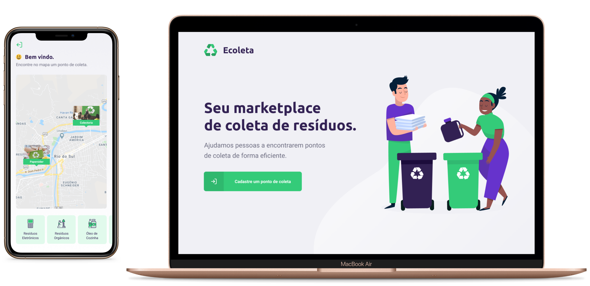

<h1 align="center">
  <br /><br />
  
</h1>

<h3 align="center">
  Ecoleta - The easiest way to throw away your trash
</h3>

<p align="center">
  
  <a href="https://www.linkedin.com/in/eliasgcf/"></a>
  
  <a href="https://github.com/EliasGcf/ecoleta/commits/master"></a>
  <a href="https://github.com/EliasGcf/ecoleta/issues"></a>
  
</p>

<p align="center">
  <a href="#recycle-about-the-project">About the project</a>&nbsp;&nbsp;&nbsp;|&nbsp;&nbsp;&nbsp;
  <a href="#-technologies">Technologies</a>&nbsp;&nbsp;&nbsp;|&nbsp;&nbsp;&nbsp;
  <a href="#-getting-started">Getting started</a>&nbsp;&nbsp;&nbsp;|&nbsp;&nbsp;&nbsp;
  <a href="#-how-to-contribute">How to contribute</a>&nbsp;&nbsp;&nbsp;|&nbsp;&nbsp;&nbsp;
  <a href="#-license">License</a>
</p>

<p id="insomniaButton" align="center">
  <a
    href="https://insomnia.rest/run/?label=Ecoleta%20API%20-%20EliasGcf&uri=https%3A%2F%2Fraw.githubusercontent.com%2FEliasGcf%2Fecoleta%2Fmaster%2FInsomnia.json"
    target="_blank"
  >
    
  </a>
</p>



## :recycle: About the project

This project was developed on the Next Level Week event by [Rocketseat](https://rocketseat.com.br/) &nbsp;🚀&nbsp;💜

With the idea to help world ecosystem, this software provide a flow to create recyclable garbage collection points and show in a map around you. In the end, you can send a text message using the whatsapp or an email, and make the world better witout trash.

## 🚀 Technologies

Technologies that I used to develop this application

- [Node.js](https://nodejs.org/en/)
- [ReactJS](https://reactjs.org/)
- [React Native](https://reactnative.dev/)
- [TypeScript](https://www.typescriptlang.org/)
- [React Leaflet](https://react-leaflet.js.org/)
- [Expo](https://expo.io/)
- [Express](https://expressjs.com/pt-br/)
- [Knex](http://knexjs.org/)
- [SQLite](https://www.sqlite.org/)
- [React Router DOM](https://reacttraining.com/react-router/)
- [React Navigation](https://reactnavigation.org/)
- [React Icons](https://react-icons.netlify.com/#/)
- [EditorConfig](https://editorconfig.org/)

## 💻 Getting started

Import the `Insomnia.json` on Insomnia App or click on [Run in Insomnia](#insomniaButton) button

### Requirements

- [Node.js](https://nodejs.org/en/)
- [Yarn](https://classic.yarnpkg.com/)
- [Expo](https://expo.io/)

**Clone the project and access the folder**

```bash
$ git clone https://github.com/EliasGcf/ecoleta.git && cd ecoleta
```

**Install dependencies**

```bash
$ yarn
```

**Follow the steps below**

### Backend

```bash
# Install the dependencies
$ yarn

# Use the script to run the migrations
$ yarn server knex:migrate

# Use the script to run the seeds
$ yarn server knex:seed

# To finish, run the api service
$ yarn server dev

# Well done, project is started!
```

### Web

_Obs.: Before to continue, be sure to have the API running_

```bash
# Install the dependencies
$ yarn

# Be sure the file 'clients/web/src/services/api.ts' have the IP to your API

# Start the client
$ yarn web start
```

### Mobile

_Obs.: Before to continue, be sure to have the API running_

```bash
# Install the dependencies
$ yarn

# Be sure the file 'clients/mobile/src/services/api.ts' have the IP to your API

# Start the expo service and scan the QR code with Expo Client
$ yarn mobile start
```

## 🤔 How to contribute

**Make a fork of this repository**

```bash
# Fork using GitHub official command line
# If you don't have the GitHub CLI, use the web site to do that.

$ gh repo fork EliasGcf/ecoleta
```

**Follow the steps below**

```bash
# Clone your fork
$ git clone your-fork-url && cd ecoleta

# Create a branch with your feature
$ git checkout -b my-feature

# Make the commit with your changes
$ git commit -m 'feat: My new feature'

# Send the code to your remote branch
$ git push origin my-feature
```

After your pull request is merged, you can delete your branch

## 📝 License

This project is licensed under the MIT License - see the [LICENSE](LICENSE) file for details.

---

Made with 💜&nbsp; by Elias Gabriel 👋 &nbsp;[See my linkedin](https://www.linkedin.com/in/eliasgcf/)
